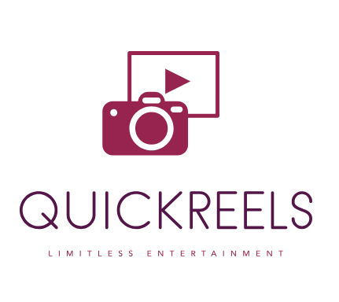

# 🚀 QuickReels: A Fast-paced Multimedia Experience

**🚀 QuickReels** is an innovative Flutter application at the forefront of technology, meticulously crafted to offer users a seamless and immersive multimedia experience. By harnessing the capabilities of the GetX framework, QuickReels underscores a meticulously structured architecture, guaranteeing durability and scalability at every stage of the development journey.

📱🎬 Leveraging the powerful features of Flutter, QuickReels presents a cutting-edge interface that seamlessly integrates multimedia content. Whether it's engaging videos, captivating images, or compelling text-based posts, QuickReels curates a dynamic environment for users to explore and indulge in diverse media types.

🔧🏗️ Engineered for scalability and flexibility, QuickReels is built upon a foundation that ensures adaptability to the evolving needs of its user base. This robust architecture, combined with the agility of the GetX framework, allows for rapid iterations and enhancements, ensuring QuickReels remains on the forefront of multimedia innovation.

  
  
  
  

## Key Features:

* **🔄 GetX Framework Integration:** QuickReels harnesses the potential of GetX, facilitating a streamlined and efficient approach to manage states, routes, and dependencies within the app.

* **🔥 Firebase Integration:** The app seamlessly integrates Firebase services for user authentication and efficient management of crucial data. Firebase's powerful authentication system ensures a secure user experience.

* **🎬 Multimedia-Centric Approach:** QuickReels focuses on delivering a dynamic multimedia experience. Users can explore and engage with a variety of multimedia content, ranging from videos to images and text-based posts.

* **🏗️ Scalable Architecture:** Built upon a robust architecture, QuickReels emphasizes scalability and maintainability, ensuring it can adapt and grow with the evolving demands of the user base.

* **🤝 User Engagement:** With an intuitive interface and efficient navigation, QuickReels fosters high user engagement, allowing users to seamlessly navigate through content, engage with others, and create their unique experiences.

* **⚡ Fast-paced Development:** Leveraging the power of GetX and Firebase, QuickReels accelerates the development process, enabling rapid iterations and quick feature enhancements.

Technologies Used:

* **📱 Flutter (UI Framework)**

* **🚦 GetX (State Management and Routing)**

* **🔐 Firebase (Authentication and Database Management)**

QuickReels offers a unique blend of seamless navigation, multimedia content delivery, and robust architecture, ensuring an immersive and efficient user experience.

## App Screenshots

Here are some screenshots from our app to give you a glimpse of its design and functionality.

### Onboarding Screens

 
 
 

